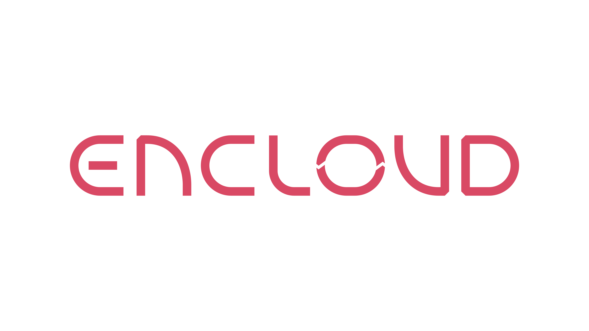

Encloud is a toolkit for making sensitive data useful for Web3. The Encloud CLI enables clients to easily on-board 
sensitive data to the Filecoin network. 

Encloud Encryption and Storage CLI is a lightweight utility that allows clients to 

- Generate their ECIES/RSA encryption keys
- Manage file and encryption metadata in a local or remote KV store
- Upload encrypted files to Filecoin
- Retrieve encrypted files from Filecoin and decrypt them
- Share encrypted files by transferring the DEK to a specified email

Encloud currently uses the [**Estuary**](https://estuary.tech/) API to upload and retrieve data from Filecoin. This allows clients to interact with the 
Filecoin network without needing to deal with crypto wallets, tokens or deal making with Filecoin storage providers as 
Estuary manages this in the background.

We plan to add more flows to enable clients to control their deal making with specific Storage Providers.
To this end we want to integrate with Singularity and its deal preparation module to  generate encrypted CAR files and make deals
with specific storage providers.

Read [**here**](docs/DESIGN.md) for detailed **design and architecture** 

## Prerequisites
- Golang 1.18 or higher
- Estuary API account and key. Read [more](docs/CONFIG.md).
- CouchbaseDB for metadata storage (optional)

## CLI Setup
 
 ```bash
# go module sync
go mod tidy

# enable encloud cli command
go install .
```

## Command reference
1) Generate ECIES secp256k1 OR RSA 2048 key pair (key encryption key or KEK) to encrypt & decrypt the AES-256 keys (data encryption key or DEK). Run below command from the root of the project to the ECIES/RSA key pair
    > encloud generate-key-pair

2) Upload encrypted data to Filecoin. This command encrypts the specified file using a newly generated DEK. The DEK is encrypted using the KEK and the metadata is stored on the local KV store. 
   This command also provides multiple `DEK_TYPE` options to encrypt data - `aes` or `chacha20`.

    > encloud upload -p `<KEK_PUBLIC_KEY>` -f `<UPLOAD_FILE_PATH>` -e `<DEK_TYPE>` 

    Read the KEK public key from a file path instead of raw text.

    > encloud upload -p `<KEK_PUBLIC_KEY_FILE_PATH>` -f `<UPLOAD_FILE_PATH>` -e `<DEK_TYPE>` -r true
3) List uploaded files and associated metadata. Metadata is used to query and retrieve the files from Filecoin. 

    > encloud list -p `<KEK_PUBLIC_KEY>`

   Read the KEK public key from a file path instead of raw text.

    > encloud list -p `<KEK_PUBLIC_KEY_FILE_PATH>` -r true
4) Retrieve data from Filecoin with a specific CID. This command decrypts encrypted data on Filecoin using the relevant DEK. The DEK is stored in encrypted form in the metadata and is itself decrypted first using the KEK Private Key. 

    > encloud retrieve-by-cid -p `<KEK_PUBLIC_KEY>` -k `<KEK_PRIVATE_KEY>` -u `<UUID>`

   Read the KEK public and private keys from a file path instead of raw text. For KEK public key pass `r` flag with `true` and for private key pass `o` flag with `true`

    > encloud retrieve-by-cid -p `<KEK_PUBLIC_KEY_FILE_PATH>` -k `<KEK_PRIVATE_KEY_PATH>` -u `<UUID>` -r true -o true
   
1) Share your files with other users using the CID and DEK.

    > encloud share -e `<EMAIL>` -p `<KEK_PUBLIC_KEY>` -k `<KEK_PRIVATE_KEY>` -u `<UUID>`

   Read the KEK public and private keys from a file path instead of raw text. For KEK public key pass `r` flag with `true` and for private key pass `o` flag with `true`

    > encloud share -e `<EMAIL>` -p `<KEK_PUBLIC_KEY_PATH>` -k `<KEK_PRIVATE_KEY_PATH>` -u `<UUID>` -r true -o true

2) Retrieve shared content from other users using your CID, DEK type and DEK.

    > encloud retrieve-shared-content -c `<RECEIVED_CID_OF_YOUR_EMAIL>` -d `<RECEIVED_DEK_FILE_PATH>` -e `<RECEIVED_DEK_TYPE>`
   
## Future features
- Distributed key management for KEKs 
- Chunking for performant file uploads 
- Integration with Singularity's Deal Preparation Framework to generate encrypted CAR files for SP ingestion
- UI for clients and storage providers

## Support

* Please file an issue to get help or report a bug.
* Storage Providers and Clients : we want to work with you to integrate our tooling and offer bespoke support, please reach
out at [contact@encloud.tech](mailto:contact@encloud.tech)

## License 
[AGPL3.0](https://github.com/encloud-tech/encloud/blob/main/LICENSE)
