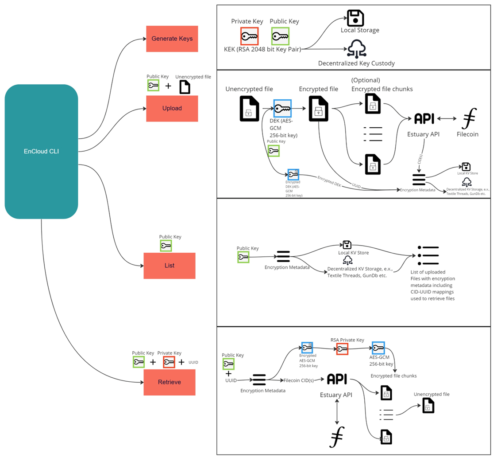

# Design and architecture 

Encloud Encryption and Storage CLI was born out of a [grant](https://github.com/filecoin-project/devgrants/issues/631) from the Filecoin Foundation. Today the Filecoin network is largely
relevant for public data sets owing to its open nature and content addressable design. Therefore, the Filecoin ecosystems has
a need for privacy tooling that can help onboard sensitive data sets in encrypted form. 

The Encloud Encryption and Storage CLI was designed to meet the encryption requirements for the Filecoin ecosystem:

* Key Wrapping with RSA Key Encryption Keys (KEKs) for wrapping AES Data Encryption Keys (DEKs) 
* DEK for each file generated
* Management of file and encryption metadata in a KV store (local or decentralized)
* Upload encrypted files to Filecoin
* Retrieve encrypted files from Filecoin and decrypt them
* Integration with existing tooling (Estuary)

## Architecture

## Future plans

* Making Metadata structure and storage interoperable with other tooling within Web3 (e.x., Fission’s WNFS)
* Storing Metadata in encrypted form in a decentralized storage to reduce data storage burden on user (e.x., Tableland etc.)
* Offering non-custodial key infrastructure and hardware-based key storage to reduce key management burden on user
* Focus on Storage Provider experience to onboard enterprise data (bespoke deal making with clients)
* Integration with existing Deal Preparation Frameworks to generate encrypted CAR files
* UI for clients and storage providers

